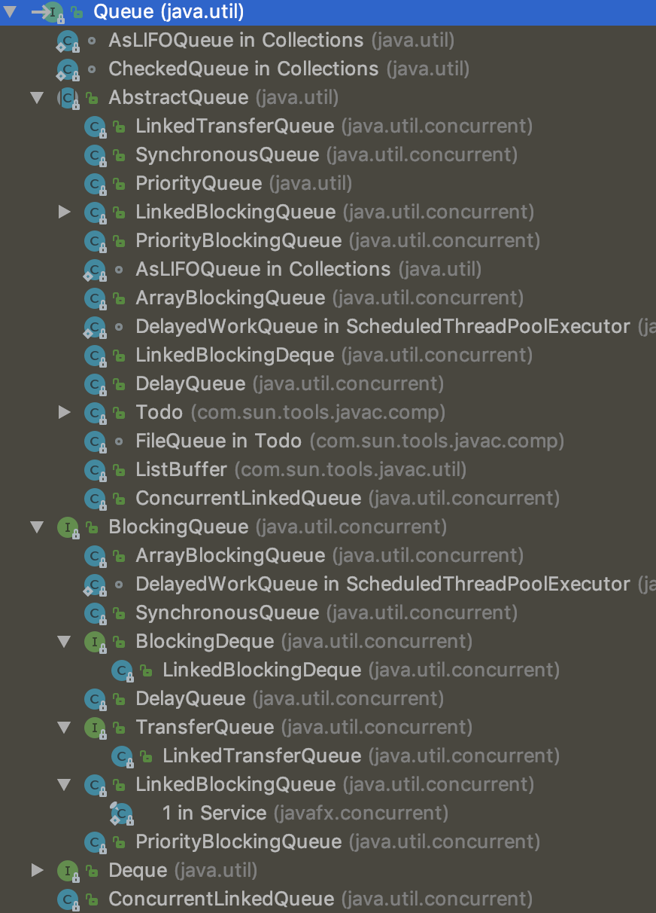
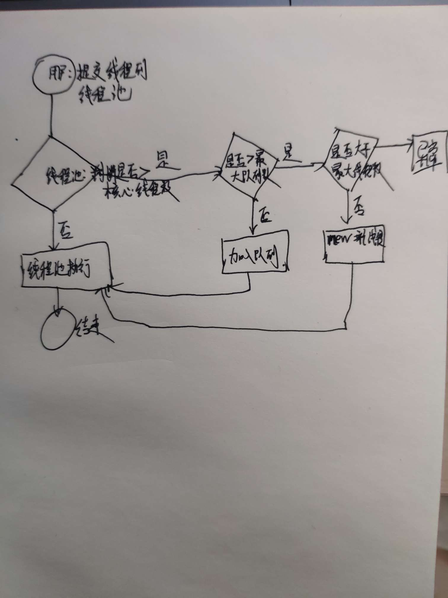
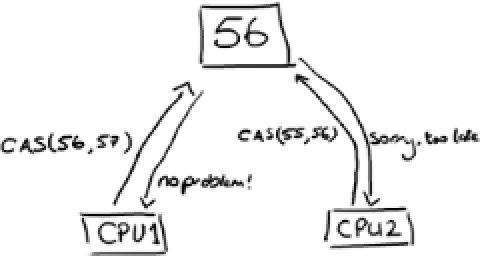

# 并发编程-学习笔记

[TOC]


## 并发包

### 计数器-CountDownLatch

CountDownLatch 类位于java.util.concurrent包下，利用它可以实现类似计数器的功能。比如有一个任务A，它要等待其他4个任务执行完毕之后才能执行，此时就可以利用CountDownLatch来实现这种功能了。CountDownLatch是通过一个计数器来实现的，计数器的初始值为线程的数量。每当一个线程完成了自己的任务后，计数器的值就会减1。当计数器值到达0时，它表示所有的线程已经完成了任务，然后在闭锁上等待的线程就可以恢复执行任务。

``` java
public static void main(String[] args) throws InterruptedException {
		CountDownLatch countDownLatch = new CountDownLatch(2);
		new Thread(new Runnable() {

			@Override
			public void run() {
				System.out.println(Thread.currentThread().getName() + ",子线程开始执行...");
				countDownLatch.countDown();
				System.out.println(Thread.currentThread().getName() + ",子线程结束执行...");
			}
		}).start();
		
		new Thread(new Runnable() {

			@Override
			public void run() {
				System.out.println(Thread.currentThread().getName() + ",子线程开始执行...");
				countDownLatch.countDown();//计数器值每次减去1
				System.out.println(Thread.currentThread().getName() + ",子线程结束执行...");
			}
		}).start();
		countDownLatch.await();// 減去为0,恢复任务继续执行
	    System.out.println("两个子线程执行完毕....");
	    System.out.println("主线程继续执行.....");
	    for (int i = 0; i <10; i++) {
			System.out.println("main,i:"+i);
		}
}
```


### 屏障-CyclicBarrier

CyclicBarrier初始化时规定一个数目，然后计算调用了CyclicBarrier.await()进入等待的线程数。当线程数达到了这个数目时，所有进入等待状态的线程被唤醒并继续。 

CyclicBarrier就象它名字的意思一样，可看成是个障碍， 所有的线程必须到齐后才能一起通过这个障碍。 

CyclicBarrier初始时还可带一个Runnable的参数， 此Runnable任务在CyclicBarrier的数目达到后，所有其它线程被唤醒前被执行。

目达到后，所有其它线程被唤醒前被执行。

```java
class Writer extends Thread {
	private CyclicBarrier cyclicBarrier;
	public Writer(CyclicBarrier cyclicBarrier){
		 this.cyclicBarrier=cyclicBarrier;
	}
	@Override
	public void run() {
		System.out.println("线程" + Thread.currentThread().getName() + ",正在写入数据");
		try {
			Thread.sleep(3000);
		} catch (Exception e) {
			// TODO: handle exception
		}
		System.out.println("线程" + Thread.currentThread().getName() + ",写入数据成功.....");
		try {
			cyclicBarrier.await();
		} catch (Exception e) {
		}
		System.out.println("所有线程执行完毕..........");
	}
}
public class Test001 {

	public static void main(String[] args) {
		CyclicBarrier cyclicBarrier=new CyclicBarrier(5);
		for (int i = 0; i < 5; i++) {
			Writer writer = new Writer(cyclicBarrier);
			writer.start();
		}
	}
}
```


### 计数信号量-Semaphore

Semaphore是一种基于计数的信号量。它可以设定一个阈值，基于此，多个线程竞争获取许可信号，做自己的申请后归还，超过阈值后，线程申请许可信号将会被阻塞。Semaphore可以用来构建一些对象池，资源池之类的，比如数据库连接池，我们也可以创建计数为1的Semaphore，将其作为一种类似互斥锁的机制，这也叫二元信号量，表示两种互斥状态。它的用法如下：

availablePermits函数用来获取当前可用的资源数量

wc.acquire(); //申请资源

wc.release();// 释放资源

```java
// 创建一个计数阈值为5的信号量对象  
// 只能5个线程同时访问  
Semaphore semp = new Semaphore(5);  
try {  
   // 申请许可  
   semp.acquire();  
   try {  
   // 业务逻辑  
   } catch (Exception e) {  
   //  
   } finally {  
   // 释放许可  
    	emp.release();  
   }  
} catch (InterruptedException e) {  
    	  
} 
```


#### 案例

需求: 一个厕所只有3个坑位，但是有10个人来上厕所，那怎么办？假设10的人的编号分别为1-10，并且1号先到厕所，10号最后到厕所。那么1-3号来的时候必然有可用坑位，顺利如厕，4号来的时候需要看看前面3人是否有人出来了，如果有人出来，进去，否则等待。同样的道理，4-10号也需要等待正在上厕所的人出来后才能进去，并且谁先进去这得看等待的人是否有素质，是否能遵守先来先上的规则。

代码:

```java
class ThradDemo001 extends Thread {
	private String name;
	private Semaphore wc;

	public ThradDemo001(String name, Semaphore wc) {
		this.name = name;
		this.wc = wc;
	}
	@Override
	public void run() {
		// 剩下的资源
		int availablePermits = wc.availablePermits();
		if (availablePermits > 0) {
			System.out.println(name + "天助我也，终于有茅坑了.....");
		} else {
			System.out.println(name + "怎么没有茅坑了...");
		}
		try {
			// 申请资源
			wc.acquire();
		} catch (InterruptedException e) {

		}
		System.out.println(name + "终于上厕所啦.爽啊" + ",剩下厕所:" + wc.availablePermits());
		try {
			Thread.sleep(new Random().nextInt(1000));
		} catch (Exception e) {
			// TODO: handle exception
		}
		System.out.println(name + "厕所上完啦!");
		// 释放资源
		wc.release();
	}
}

public class TestSemaphore {

	public static void main(String[] args) {
		Semaphore semaphore = new Semaphore(3);
		for (int i = 1; i <= 10; i++) {
			ThradDemo001 thradDemo001 = new ThradDemo001("第" + i + "个人", semaphore);
			thradDemo001.start();
		}
	}

} 
```


## 并发队列

在并发队列上JDK提供了两套实现，一个是以ConcurrentLinkedQueue为代表的高性能队

列非阻塞队列，一个是以BlockingQueue接口为代表的阻塞队列，无论哪种都继承自Queue。




### 阻塞队列与非阻塞队列

阻塞队列与普通队列的区别在于，当队列是空的时，从队列中获取元素的操作将会被阻塞，或者当队列是满时，往队列里添加元素的操作会被阻塞。试图从空的阻塞队列中获取元素的线程将会被阻塞，直到其他的线程往空的队列插入新的元素。同样，试图往已满的阻塞队列中添加新元素的线程同样也会被阻塞，直到其他的线程使队列重新变得空闲起来，如从队列中移除一个或者多个元素，或者完全清空队列.

1. ArrayDeque, （数组双端队列） 

2. PriorityQueue, （优先级队列） 

3. ConcurrentLinkedQueue, （基于链表的并发队列） 

4. DelayQueue, （延期阻塞队列）（阻塞队列实现了BlockingQueue接口） 

5. ArrayBlockingQueue, （基于数组的并发阻塞队列） 

6. LinkedBlockingQueue, （基于链表的FIFO阻塞队列） 

7. LinkedBlockingDeque, （基于链表的FIFO双端阻塞队列） 

8. PriorityBlockingQueue, （带优先级的无界阻塞队列） 

9. SynchronousQueue （并发同步阻塞队列）


#### ConcurrentLinkedDeque

ConcurrentLinkedQueue : 是一个适用于高并发场景下的队列，通过无锁的方式，实现
了高并发状态下的高性能，通常ConcurrentLinkedQueue性能好于BlockingQueue.它
是一个基于链接节点的无界线程安全队列。该队列的元素遵循先进先出的原则。头是最先
加入的，尾是最近加入的，该队列不允许null元素。

ConcurrentLinkedQueue重要方法:
add 和offer() 都是加入元素的方法(在ConcurrentLinkedQueue中这俩个方法没有任何区别)
poll() 和peek() 都是取头元素节点，区别在于前者会删除元素，后者不会。

```java
	ConcurrentLinkedDeque q = new ConcurrentLinkedDeque();
	q.offer("周杰伦");
	q.offer("林俊杰");
	q.offer("毛不易");
	q.offer("刘欢");
	q.offer("李荣浩");
	//从头获取元素,删除该元素
	System.out.println(q.poll());
	//从头获取元素,不刪除该元素
	System.out.println(q.peek());
	//获取总长度
	System.out.println(q.size());
```


#### BlockingQueue

阻塞队列（BlockingQueue）是一个支持两个附加操作的队列。这两个附加的操作是：

在队列为空时，获取元素的线程会等待队列变为非空。

当队列满时，存储元素的线程会等待队列可用。 

阻塞队列常用于生产者和消费者的场景，生产者是往队列里添加元素的线程，消费者是从队列里拿元素的线程。阻塞队列就是生产者存放元素的容器，而消费者也只从容器里拿元素。

BlockingQueue即阻塞队列，从阻塞这个词可以看出，在某些情况下对阻塞队列的访问可能会造成阻塞。被阻塞的情况主要有如下两种：

1. 当队列满了的时候进行入队列操作。
2. 当队列空了的时候进行出队列操作。

因此，当一个线程试图对一个已经满了的队列进行入队列操作时，它将会被阻塞，除非有另一个线程做了出队列操作；同样，当一个线程试图对一个空队列进行出队列操作时，它将会被阻塞，除非有另一个线程进行了入队列操作。

在Java中，BlockingQueue的接口位于java.util.concurrent 包中(在Java5版本开始提供)，由上面介绍的阻塞队列的特性可知，阻塞队列是线程安全的。

在新增的Concurrent包中，BlockingQueue很好的解决了多线程中，如何高效安全“传输”数据的问题。通过这些高效并且线程安全的队列类，为我们快速搭建高质量的多线程程序带来极大的便利。本文详细介绍了BlockingQueue家庭中的所有成员，包括他们各自的功能以及常见使用场景。

##### 认识BlockingQueue

阻塞队列，顾名思义，首先它是一个队列，通过一个共享的队列，可以使得数据由队列的一端输入，从			 另外一端输出；常用的队列主要有以下两种：（当然通过不同的实现方式，还可以延伸出很多不同类型的队列，DelayQueue就是其中的一种）

**先进先出（FIFO）：先插入的队列的元素也最先出队列，类似于排队的功能。从某种程度上来说这种队列也体现了一种公平性。**

**后进先出（LIFO）：后插入队列的元素最先出队列，这种队列优先处理最近发生的事件**。

多线程环境中，通过队列可以很容易实现数据共享，比如经典的“生产者”和“消费者”模型中，通过队列可以很便利地实现两者之间的数据共享。假设我们有若干生产者线程，另外又有若干个消费者线程。如果生产者线程需要把准备好的数据共享给消费者线程，利用队列的方式来传递数据，就可以很方便地解决他们之间的数据共享问题。但如果生产者和消费者在某个时间段内，万一发生数据处理速度不匹配的情况呢？理想情况下，如果生产者产出数据的速度大于消费者消费的速度，并且当生产出来的数据累积到一定程度的时候，那么生产者必须暂停等待一下（阻塞生产者线程），以便等待消费者线程把累积的数据处理完毕，反之亦然。然而，在concurrent包发布以前，在多线程环境下，我们每个程序员都必须去自己控制这些细节，尤其还要兼顾效率和线程安全，而这会给我们的程序带来不小的复杂度。好在此时，强大的concurrent包横空出世了，而他也给我们带来了强大的BlockingQueue。（在多线程领域：所谓阻塞，在某些情况下会挂起线程（即阻塞），一旦条件满足，被挂起的线程又会自动被唤醒）


##### ArrayBlockingQueue

ArrayBlockingQueue是一个有边界的阻塞队列，它的内部实现是一个数组。有边界的意思是它的容量是有限的，我们必须在其初始化的时候指定它的容量大小，容量大小一旦指定就不可改变。

ArrayBlockingQueue是以先进先出的方式存储数据，最新插入的对象是尾部，最新移出的对象是头部。下面

是一个初始化和使用ArrayBlockingQueue的例子：

```java
BlockingQueue<String> arrays = new ArrayBlockingQueue<String>(3);
	arrays.add("李四");
	arrays.add("张军");
	arrays.add("张军");
	// 添加阻塞队列
	arrays.offer("张三", 1, TimeUnit.SECONDS);
```


##### LinkedBlockingQueue

LinkedBlockingQueue阻塞队列大小的配置是可选的，如果我们初始化时指定一个大小，它就是有边界的，如果不指定，它就是无边界的。说是无边界，其实是采用了默认大小为Integer.MAX_VALUE的容量 。它的内部实现是一个链表。

和ArrayBlockingQueue一样，LinkedBlockingQueue 也是以先进先出的方式存储数据，最新插入的对象是尾部，最新移出的对象是头部。下面是一个初始化和使LinkedBlockingQueue的例子：

```java
LinkedBlockingQueue linkedBlockingQueue = new LinkedBlockingQueue(3);
linkedBlockingQueue.add("张三");
linkedBlockingQueue.add("李四");
linkedBlockingQueue.add("李四");
System.out.println(linkedBlockingQueue.size());
```


##### PriorityBlockingQueue

PriorityBlockingQueue是一个没有边界的队列，它的排序规则和 java.util.PriorityQueue一样。需要注意，PriorityBlockingQueue中允许插入null对象。

所有插入PriorityBlockingQueue的对象必须实现 java.lang.Comparable接口，队列优先级的排序规则就 是按照我们对这个接口的实现来定义的。

另外，我们可以从PriorityBlockingQueue获得一个迭代器Iterator，但这个迭代器并不保证按照优先级顺 序进行迭代。
​	

##### SynchronousQueue

SynchronousQueue队列内部仅允许容纳一个元素。当一个线程插入一个元素后会被阻塞，除非这个元素被另一个线程消费。


##### 使用BlockingQueue模拟生产者与消费者

```java
class ProducerThread implements Runnable {
	private BlockingQueue<String> blockingQueue;
	private AtomicInteger count = new AtomicInteger();
	private volatile boolean FLAG = true;

	public ProducerThread(BlockingQueue<String> blockingQueue) {
		this.blockingQueue = blockingQueue;
	}

	@Override
	public void run() {
		System.out.println(Thread.currentThread().getName() + "生产者开始启动....");
		while (FLAG) {
			String data = count.incrementAndGet() + "";
			try {
				boolean offer = blockingQueue.offer(data, 2, TimeUnit.SECONDS);
				if (offer) {
					System.out.println(Thread.currentThread().getName() + ",生产队列" + data + "成功..");
				} else {
					System.out.println(Thread.currentThread().getName() + ",生产队列" + data + "失败..");
				}
				Thread.sleep(1000);
			} catch (Exception e) {

			}
		}
		System.out.println(Thread.currentThread().getName() + ",生产者线程停止...");
	}

	public void stop() {
		this.FLAG = false;
	}

}

class ConsumerThread implements Runnable {
	private volatile boolean FLAG = true;
	private BlockingQueue<String> blockingQueue;

	public ConsumerThread(BlockingQueue<String> blockingQueue) {
		this.blockingQueue = blockingQueue;
	}

	@Override
	public void run() {
		System.out.println(Thread.currentThread().getName() + "消费者开始启动....");
		while (FLAG) {
			try {
				String data = blockingQueue.poll(2, TimeUnit.SECONDS);
				if (data == null || data == "") {
					FLAG = false;
					System.out.println("消费者超过2秒时间未获取到消息.");
					return;
				}
				System.out.println("消费者获取到队列信息成功,data:" + data);

			} catch (Exception e) {
				// TODO: handle exception
			}
		}
	}

}

public class Test0008 {

	public static void main(String[] args) {
		BlockingQueue<String> blockingQueue = new LinkedBlockingQueue<>(3);
		ProducerThread producerThread = new ProducerThread(blockingQueue);
		ConsumerThread consumerThread = new ConsumerThread(blockingQueue);
		Thread t1 = new Thread(producerThread);
		Thread t2 = new Thread(consumerThread);
		t1.start();
		t2.start();
		//10秒后 停止线程..
		try {
			Thread.sleep(10*1000);
			producerThread.stop();
		} catch (Exception e) {
			// TODO: handle exception
		}
	}

}
```


## 线程池

### 什么是线程池

Java中的线程池是运用场景最多的并发框架，几乎所有需要异步或并发执行任务的程序都可以使用线程池。在开发过程中，合理地使用线程池能够带来3个好处。

第一：降低资源消耗。通过重复利用已创建的线程降低线程创建和销毁造成的消耗。
第二：提高响应速度。当任务到达时，任务可以不需要等到线程创建就能立即执行。
第三：提高线程的可管理性。线程是稀缺资源，如果无限制地创建，不仅会消耗系统资源，还会降低系统的稳定性，使用线程池可以进行统一分配、调优和监控。但是，要做到合理利用线程池，必须对其实现原理了如指掌。

### 线程池作用

线程池是为突然大量爆发的线程设计的，通过有限的几个固定线程为大量的操作服务，减少了创建和销毁线程所需的时间，从而提高效率。
​	

如果一个线程的时间非常长，就没必要用线程池了(不是不能作长时间操作，而是不宜。)，况且我们还不能控制线程池中线程的开始、挂起、和中止。

### 线程池的分类
#### ThreadPoolExecutor
Java是天生就支持并发的语言，支持并发意味着多线程，线程的频繁创建在高并发及大数据量是非常消耗资源的，因为java提供了线程池。在jdk1.5以前的版本中，线程池的使用是及其简陋的，但是在JDK1.5后，有了很大的改善。JDK1.5之后加入了java.util.concurrent包，java.util.concurrent包的加入给予开发人员开发并发程序以及解决并发问题很大的帮助。这篇文章主要介绍下并发包下的Executor接口，Executor接口虽然作为一个非常旧的接口（JDK1.5 2004年发布），但是很多程序员对于其中的一些原理还是不熟悉，因此写这篇文章来介绍下Executor接口，同时巩固下自己的知识。如果文章中有出现错误，欢迎大家指出。
Executor框架的最顶层实现是ThreadPoolExecutor类，Executors工厂类中提供的newScheduledThreadPool、newFixedThreadPool、newCachedThreadPool方法其实也只是ThreadPoolExecutor的构造函数参数不同而已。通过传入不同的参数，就可以构造出适用于不同应用场景下的线程池，那么它的底层原理是怎样实现的呢，这篇就来介绍下ThreadPoolExecutor线程池的运行过程。

**corePoolSize： 核心池的大小。 当有任务来之后，就会创建一个线程去执行任务，当线程池中的线程数目达到corePoolSize后，就会把到达的任务放到缓存队列当中**

**maximumPoolSize： 线程池最大线程数，它表示在线程池中最多能创建多少个线程；**

**keepAliveTime： 表示线程没有任务执行时最多保持多久时间会终止。**
**unit： 参数keepAliveTime的时间单位，有7种取值，在TimeUnit类中有7种静态属性。**


### 线程池四种创建方式

Java通过Executors（jdk1.5并发包）提供四种线程池，分别为：

**newCachedThreadPool创建一个可缓存线程池，如果线程池长度超过处理需要，可灵活回收空闲线程，若无可回收，则新建线程。**

**newFixedThreadPool 创建一个定长线程池，可控制线程最大并发数，超出的线程会在队列中等待。**

**newScheduledThreadPool 创建一个定长线程池，支持定时及周期性任务执行。**

**newSingleThreadExecutor 创建一个单线程化的线程池，它只会用唯一的工作线程来执行任务，保证所有任务按照指定顺序(FIFO, LIFO, 优先级)执行。**


#### newCachedThreadPool

创建一个可缓存线程池，如果线程池长度超过处理需要，可灵活回收空闲线程，若无可回收，则新建线程。示例代码如下：

```java
// 无限大小线程池 jvm自动回收
ExecutorService newCachedThreadPool = Executors.newCachedThreadPool();
for (int i = 0; i < 10; i++) {
	final int temp = i;
	newCachedThreadPool.execute(new Runnable() {

		@Override
		public void run() {
			try {
				Thread.sleep(100);
			} catch (Exception e) {
				// TODO: handle exception
			}
			System.out.println(Thread.currentThread().getName() + ",i:" + temp);

		}
	});
}
```

**总结: 线程池为无限大，当执行第二个任务时第一个任务已经完成，会复用执行第一个任务的线程，而不用每次新建线程。**


#### newFixedThreadPool

创建一个定长线程池，可控制线程最大并发数，超出的线程会在队列中等待。示例代码如下：

```java
ExecutorService newFixedThreadPool = Executors.newFixedThreadPool(5);
for (int i = 0; i < 10; i++) {
	final int temp = i;
	newFixedThreadPool.execute(new Runnable() {

		@Override
		public void run() {
			System.out.println(Thread.currentThread().getId() + ",i:" + temp);

		}
	});
}
```

**总结:因为线程池大小为3，每个任务输出index后sleep 2秒，所以每两秒打印3个数字。**
**定长线程池的大小最好根据系统资源进行设置。如Runtime.getRuntime().availableProcessors()**


#### newScheduledThreadPool

创建一个定长线程池，支持定时及周期性任务执行。延迟执行示例代码如下：

```java
ScheduledExecutorService newScheduledThreadPool = Executors.newScheduledThreadPool(5);
		for (int i = 0; i < 10; i++) {
			final int temp = i;
			newScheduledThreadPool.schedule(new Runnable() {
				public void run() {
					System.out.println("i:" + temp);
				}
			}, 3, TimeUnit.SECONDS);
}
```

**表示延迟3秒执行。**


#### newSingleThreadExecutor

创建一个单线程化的线程池，它只会用唯一的工作线程来执行任务，保证所有任务按照指定顺序(FIFO, LIFO, 优先级)执行。示例代码如下：

```java
ExecutorService newSingleThreadExecutor = Executors.newSingleThreadExecutor();
for (int i = 0; i < 10; i++) {
	final int index = i;
	newSingleThreadExecutor.execute(new Runnable() {

		@Override
		public void run() {
			System.out.println("index:" + index);
			try {
				Thread.sleep(200);
			} catch (Exception e) {
				// TODO: handle exception
			}
		}
	});
}
```

**注意: 结果依次输出，相当于顺序执行各个任务。**


### 线程池原理剖析

提交一个任务到线程池中，线程池的处理流程如下：

1、判断线程池里的核心线程是否都在执行任务，如果不是（核心线程空闲或者还有核心线程没有被创建）则创建一个新的工作线程来执行任务。如果核心线程都在执行任务，则进入下个流程。

2、线程池判断工作队列是否已满，如果工作队列没有满，则将新提交的任务存储在这个工作队列里。如果工作队列满了，则进入下个流程。

3、判断线程池里的线程是否都处于工作状态，如果没有，则创建一个新的工作线程来执行任务。如果已经满了，则交给饱和策略来处理这个任务。




### 自定义线程线程池

如果当前线程池中的线程数目小于corePoolSize，则每来一个任务，就会创建一个线程去执行这个任务；

如果当前线程池中的线程数目>=corePoolSize，则每来一个任务，会尝试将其添加到任务缓存队列当中，若添加成功，则该任务会等待空闲线程将其取出去执行；若添加失败（一般来说是任务缓存队列已满），则会尝试创建新的线程去执行这个任务；

如果队列已经满了，则在总线程数不大于maximumPoolSize的前提下，则创建新的线程

如果当前线程池中的线程数目达到maximumPoolSize，则会采取任务拒绝策略进行处理；

如果线程池中的线程数量大于 corePoolSize时，如果某线程空闲时间超过keepAliveTime，线程将被终止，直至线程池中的线程数目不大于corePoolSize；如果允许为核心池中的线程设置存活时间，那么核心池中的线程空闲时间超过keepAliveTime，线程也会被终止。

```java
public class Test0007 {

	public static void main(String[] args) {
		ThreadPoolExecutor executor = new ThreadPoolExecutor(1, 2, 60L, TimeUnit.SECONDS, new ArrayBlockingQueue<>(3));
		for (int i = 1; i <= 6; i++) {
			TaskThred t1 = new TaskThred("任务" + i);
			executor.execute(t1);
		}
		executor.shutdown();
	}
}

class TaskThred implements Runnable {
	private String taskName;

	public TaskThred(String taskName) {
		this.taskName = taskName;
	}

	@Override
	public void run() {
		System.out.println(Thread.currentThread().getName()+taskName);
	}

}
```


### 合理配置线程池

#### CPU密集

CPU密集的意思是该任务需要大量的运算，而没有阻塞，CPU一直全速运行。 

CPU密集任务只有在真正的多核CPU上才可能得到加速(通过多线程)，而在单核CPU上，无论你开几个模拟的多线程，该任务都不可能得到加速，因为CPU总的运算能力就那些。


#### IO密集

IO密集型，即该任务需要大量的IO，即大量的阻塞。在单线程上运行IO密集型的任务会导致浪费大量的CPU运算能力浪费在等待。所以在IO密集型任务中使用多线程可以大大的加速程序运行，即时在单核CPU上，这种加速主要就是利用了被浪费掉的阻塞时间。

 

如何合理的设置线程池大小。 

要想合理的配置线程池的大小，首先得分析任务的特性，可以从以下几个角度分析：

1.	任务的性质：CPU密集型任务、IO密集型任务、混合型任务。

2.	任务的优先级：高、中、低。

3.	任务的执行时间：长、中、短。

4.	任务的依赖性：是否依赖其他系统资源，如数据库连接等。

性质不同的任务可以交给不同规模的线程池执行。

对于不同性质的任务来说，CPU密集型任务应配置尽可能小的线程，如配置CPU个数+1的线程数，IO密集型任务应配置尽可能多的线程，因为IO操作不占用CPU，不要让CPU闲下来，应加大线程数量，如配置两倍CPU个数+1，而对于混合型的任务，如果可以拆分，拆分成IO密集型和CPU密集型分别处理，前提是两者运行的时间是差不多的，如果处理时间相差很大，则没必要拆分了。

若任务对其他系统资源有依赖，如某个任务依赖数据库的连接返回的结果，这时候等待的时间越长，则CPU空闲的时间越长，那么线程数量应设置得越大，才能更好的利用CPU。 

当然具体合理线程池值大小，需要结合系统实际情况，在大量的尝试下比较才能得出，以上只是前人总结的规律。

 

最佳线程数目 = （（线程等待时间+线程CPU时间）/线程CPU时间 ）* CPU数目

比如平均每个线程CPU运行时间为0.5s，而线程等待时间（非CPU运行时间，比如IO）为1.5s，CPU核心数为8，那么根据上面这个公式估算得到：((0.5+1.5)/0.5)*8=32。这个公式进一步转化为：

最佳线程数目 = （线程等待时间与线程CPU时间之比 + 1）* CPU数目

可以得出一个结论： 
线程等待时间所占比例越高，需要越多线程。线程CPU时间所占比例越高，需要越少线程。 
以上公式与之前的CPU和IO密集型任务设置线程数基本吻合。

**结论：**

**CPU密集型时，任务可以少配置线程数，大概和机器的cpu核数相当，这样可以使得每个线程都在执行任务**

**IO密集型时，大部分线程都阻塞，故需要多配置线程数，2*cpu核数**

**操作系统之名称解释：**

**某些进程花费了绝大多数时间在计算上，而其他则在等待I/O上花费了大多是时间，**

**前者称为计算密集型（CPU密集型）computer-bound，后者称为I/O密集型，I/O-bound。**


## JAVA锁

### 重入锁

锁作为并发共享数据，保证一致性的工具，在JAVA平台有多种实现(如 synchronized（重量级） 和 ReentrantLock(轻量级)等等 ) 。这些已经写好提供的锁为我们开发提供了便利。

重入锁，也叫做递归锁，指的是同一线程 外层函数获得锁之后 ，内层递归函数仍然有获取该锁的代码，但不受影响。

在JAVA环境下 ReentrantLock 和synchronized 都是 可重入锁

```java
public class Test implements Runnable {
	public  synchronized void get() {
		System.out.println("name:" + Thread.currentThread().getName() + " get();");
		set();
	}

	public synchronized  void set() {
		System.out.println("name:" + Thread.currentThread().getName() + " set();");
	}

	@Override

	public void run() {
		get();
	}

	public static void main(String[] args) {
		Test ss = new Test();
		new Thread(ss).start();
		new Thread(ss).start();
		new Thread(ss).start();
		new Thread(ss).start();
	}
}
```

```java
public class Test02 extends Thread {
	ReentrantLock lock = new ReentrantLock();
	public void get() {
		lock.lock();
		System.out.println(Thread.currentThread().getId());
		set();
		lock.unlock();
	}
	public void set() {
		lock.lock();
		System.out.println(Thread.currentThread().getId());
		lock.unlock();
	}
	@Override
	public void run() {
		get();
	}
	public static void main(String[] args) {
		Test ss = new Test();
		new Thread(ss).start();
		new Thread(ss).start();
		new Thread(ss).start();
	}

}
```

### 读写锁

相比[Java中的锁(Locks in Java)](http://ifeve.com/locks/)里Lock实现，读写锁更复杂一些。假设你的程序中涉及到对一些共享资源的读和写操作，且写操作没有读操作那么频繁。在没有写操作的时候**，两个线程同时读一个资源没有任何问题，所以应该允许多个线程能在同时读取共享资源。但是如果有一个线程想去写这些共享资源，就不应该再有其它线程对该资源进行读或写**（译者注：也就是说：读-读能共存，读-写不能共存，写-写不能共存）。这就需要一个读/写锁来解决这个问题。Java5在java.util.concurrent包中已经包含了读写锁。尽管如此，我们还是应该了解其实现背后的原理。

```java
public class Cache {
	static Map<String, Object> map = new HashMap<String, Object>();
	static ReentrantReadWriteLock rwl = new ReentrantReadWriteLock();
	static Lock r = rwl.readLock();
	static Lock w = rwl.writeLock();

	// 获取一个key对应的value
	public static final Object get(String key) {
		r.lock();
		try {
			System.out.println("正在做读的操作,key:" + key + " 开始");
			Thread.sleep(100);
			Object object = map.get(key);
			System.out.println("正在做读的操作,key:" + key + " 结束");
			System.out.println();
			return object;
		} catch (InterruptedException e) {

		} finally {
			r.unlock();
		}
		return key;
	}

	// 设置key对应的value，并返回旧有的value
	public static final Object put(String key, Object value) {
		w.lock();
		try {

			System.out.println("正在做写的操作,key:" + key + ",value:" + value + "开始.");
			Thread.sleep(100);
			Object object = map.put(key, value);
			System.out.println("正在做写的操作,key:" + key + ",value:" + value + "结束.");
			System.out.println();
			return object;
		} catch (InterruptedException e) {

		} finally {
			w.unlock();
		}
		return value;
	}

	// 清空所有的内容
	public static final void clear() {
		w.lock();
		try {
			map.clear();
		} finally {
			w.unlock();
		}
	}

	public static void main(String[] args) {
		new Thread(new Runnable() {

			@Override
			public void run() {
				for (int i = 0; i < 10; i++) {
					Cache.put(i + "", i + "");
				}

			}
		}).start();
		new Thread(new Runnable() {

			@Override
			public void run() {
				for (int i = 0; i < 10; i++) {
					Cache.get(i + "");
				}

			}
		}).start();
	}
}
```


### 悲观锁、乐观锁

#### 乐观锁

总是认为不会产生并发问题，每次去取数据的时候总认为不会有其他线程对数据进行修改，因此不会上锁，但是在更新时会判断其他线程在这之前有没有对数据进行修改，一般会使用版本号机制或CAS操作实现。

**version方式：**一般是在数据表中加上一个数据版本号version字段，表示数据被修改的次数，当数据被修改时，version值会加一。当线程A要更新数据值时，在读取数据的同时也会读取version值，在提交更新时，若刚才读取到的version值为当前数据库中的version值相等时才更新，否则重试更新操作，直到更新成功。

**核心SQL语句update table set x=x+1, version=version+1 where id=#{id} and version=#{version};**    

**CAS操作方式**：即compare and swap 或者 compare and set，涉及到三个操作数，数据所在的内存值，预期值，新值。当需要更新时，判断当前内存值与之前取到的值是否相等，若相等，则用新值更新，若失败则重试，一般情况下是一个自旋操作，即不断的重试。

#### 悲观锁

总是假设最坏的情况，每次取数据时都认为其他线程会修改，所以都会加锁（读锁、写锁、行锁等），当其他线程想要访问数据时，都需要阻塞挂起。可以依靠数据库实现，如行锁、读锁和写锁等，都是在操作之前加锁，在Java中，synchronized的思想也是悲观锁。


### 原子类

java.util.concurrent.atomic包：原子类的小工具包，支持在单个变量上解除锁的线程安全编程

原子变量类相当于一种泛化的 volatile 变量，能够支持原子的和有条件的读-改-写操作。AtomicInteger 表示一个int类型的值，并提供了 get 和 set 方法，这些 Volatile 类型的int变量在读取和写入上有着相同的内存语义。它还提供了一个原子的 compareAndSet 方法（如果该方法成功执行，那么将实现与读取/写入一个 volatile 变量相同的内存效果），以及原子的添加、递增和递减等方法。AtomicInteger 表面上非常像一个扩展的 Counter 类，但在发生竞争的情况下能提供更高的可伸缩性，因为它直接利用了硬件对并发的支持。


#### 为什么会有原子类

CAS：Compare and Swap，即比较再交换。

jdk5增加了并发包java.util.concurrent.*,其下面的类使用CAS算法实现了区别于synchronouse同步锁的一种乐观锁。JDK 5之前Java语言是靠synchronized关键字保证同步的，这是一种独占锁，也是是悲观锁。

如果同一个变量要被多个线程访问，则可以使用该包中的类

AtomicBoolean
AtomicInteger
AtomicLong
AtomicReference


#### CAS无锁模式

##### **什么是CAS**

CAS：Compare and Swap，即比较再交换。
jdk5增加了并发包java.util.concurrent.*,其下面的类使用CAS算法实现了区别于synchronouse同步锁的一种乐观锁。JDK 5之前Java语言是靠synchronized关键字保证同步的，这是一种独占锁，也是是悲观锁。

##### **CAS算法理解**

（1）与锁相比，使用比较交换（下文简称CAS）会使程序看起来更加复杂一些。但由于其非阻塞性，它对死锁问题天生免疫，并且，线程间的相互影响也远远比基于锁的方式要小。更为重要的是，使用无锁的方式完全没有锁竞争带来的系统开销，也没有线程间频繁调度带来的开销，因此，它要比基于锁的方式拥有更优越的性能。

（2）无锁的好处：

第一，在高并发的情况下，它比有锁的程序拥有更好的性能；
第二，它天生就是死锁免疫的。

就凭借这两个优势，就值得我们冒险尝试使用无锁的并发。

（3）CAS算法的过程是这样：**它包含三个参数CAS(V,E,N): V表示要更新的变量，E表示预期值，N表示新值。仅当V值等于E值时，才会将V的值设为N，如果V值和E值不同，则说明已经有其他线程做了更新，则当前线程什么都不做。最后，CAS返回当前V的真实值**。

（4）CAS操作是抱着乐观的态度进行的，它总是认为自己可以成功完成操作。当多个线程同时使用CAS操作一个变量时，只有一个会胜出，并成功更新，其余均会失败。失败的线程不会被挂起，仅是被告知失败，并且允许再次尝试，当然也允许失败的线程放弃操作。基于这样的原理，CAS操作即使没有锁，也可以发现其他线程对当前线程的干扰，并进行恰当的处理。

（5）简单地说，CAS需要你额外给出一个期望值，也就是你认为这个变量现在应该是什么样子的。如果变量不是你想象的那样，那说明它已经被别人修改过了。你就重新读取，再次尝试修改就好了。

（6）在硬件层面，大部分的现代处理器都已经支持原子化的CAS指令。在JDK 5.0以后，虚拟机便可以使用这个指令来实现并发操作和并发数据结构，并且，这种操作在虚拟机中可以说是无处不在。


#### 常用原子类

Java中的原子操作类大致可以分为4类：**原子更新基本类型、原子更新数组类型、原子更新引用类型、原子更新属性类型**。这些原子类中都是用了无锁的概念，有的地方直接使用CAS操作的线程安全的类型。

**AtomicBoolean**

**AtomicInteger**

**AtomicLong**

**AtomicReference**

```java
public class Test0001 implements Runnable {
	private static Integer count = 1;
	private static AtomicInteger atomic = new AtomicInteger();

	@Override
	public void run() {
		while (true) {
			int count = getCountAtomic();
			System.out.println(count);
			if (count >= 150) {
				break;
			}
		}
	}

	public synchronized Integer getCount() {
		try {
			Thread.sleep(50);
		} catch (Exception e) {
			// TODO: handle exception
		}

		return count++;
	}

	public Integer getCountAtomic() {
		try {
			Thread.sleep(50);
		} catch (Exception e) {
			// TODO: handle exception
		}
		return atomic.incrementAndGet();
	}

	public static void main(String[] args) {
		Test0001 test0001 = new Test0001();
		Thread t1 = new Thread(test0001);
		Thread t2 = new Thread(test0001);
		t1.start();
		t2.start();
	}

}
```


##### CAS（乐观锁算法）的基本假设前提

CAS比较与交换的伪代码可以表示为：

do{  
​       备份旧数据；  
​       基于旧数据构造新数据；  
}while(!CAS( 内存地址，备份的旧数据，新数据 ))  




（上图的解释：CPU去更新一个值，但如果想改的值不再是原来的值，操作就失败，因为很明显，有其它操作先改变了这个值。）

就是指当两者进行比较时，如果相等，则证明共享数据没有被修改，替换成新值，然后继续往下运行；如果不相等，说明共享数据已经被修改，放弃已经所做的操作，然后重新执行刚才的操作。容易看出 CAS 操作是基于共享数据不会被修改的假设，采用了类似于数据库的 commit-retry 的模式。当同步冲突出现的机会很少时，这种假设能带来较大的性能提升。


```java
public final int getAndAddInt(Object o, long offset, int delta) {
        int v;
        do {
            v = getIntVolatile(o, offset);
        } while (!compareAndSwapInt(o, offset, v, v + delta));
        return v;
    }
```

```java
/** 
 * Atomically increments by one the current value. 
 * 
 * @return the updated value 
 */  
public final int incrementAndGet() {  
    for (;;) {  
        //获取当前值  
        int current = get();  
        //设置期望值  
        int next = current + 1;  
        //调用Native方法compareAndSet，执行CAS操作  
        if (compareAndSet(current, next))  
            //成功后才会返回期望值，否则无线循环  
            return next;  
    }  
}  
```

#### CAS缺点

CAS存在一个很明显的问题，即ABA问题。 

问题：如果变量V初次读取的时候是A，并且在准备赋值的时候检查到它仍然是A，那能说明它的值没有被其他线程修改过了吗？

如果在这段期间曾经被改成B，然后又改回A，那CAS操作就会误认为它从来没有被修改过。针对这种情况，java并发包中提供了一个带有标记的原子引用类AtomicStampedReference，它可以通过控制变量值的版本来保证CAS的正确性。

